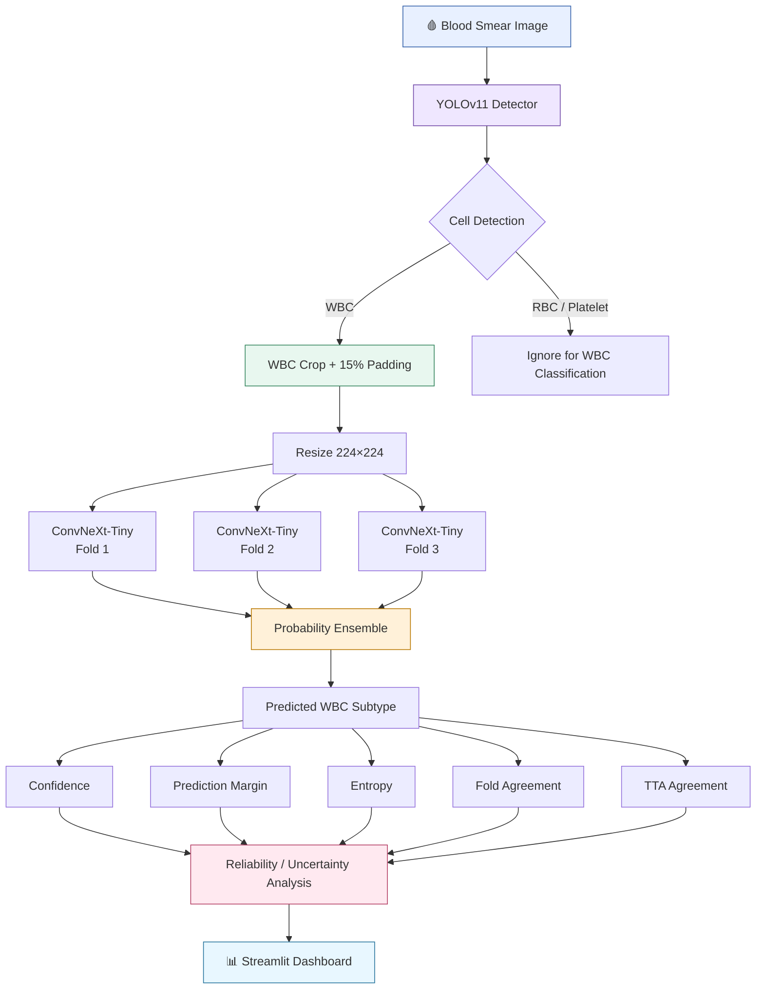
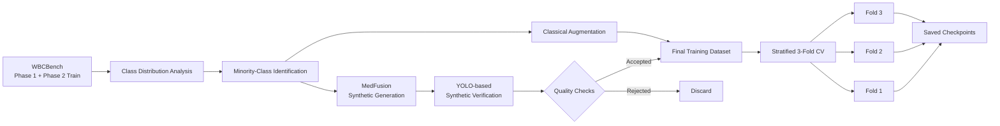

# 🩸 WBC Detection & Classification

> **End-to-end AI pipeline for detecting WBCs in blood-smear images and classifying them into 13 WBC subtypes — with synthetic-data verification, 3-fold ConvNeXt ensemble inference, Grad-CAM, uncertainty analysis, and Streamlit deployment.**

---
website: https://wbc-detection-classification-2huxpqo6zrehgsjaspnvsu.streamlit.app/

Demo:


## 🎯 Why this project?

Automated WBC analysis is challenging because blood-smear images contain many visually similar cells and the original training data is highly imbalanced.

This project solves the problem as a **two-stage computer-vision system**:

1. **YOLOv11** localizes cellular regions and extracts the WBC.
2. **Three ConvNeXt-Tiny models** classify the extracted WBC into one of 13 subtypes.
3. Predictions are combined at the **probability level**.
4. **Confidence, margin, entropy, fold agreement, and TTA agreement** provide additional reliability signals.
5. The complete workflow is exposed through an interactive **Streamlit dashboard**.

---

# 🔥 End-to-End Pipeline



### Training / Data Engineering Pipeline



---

# 📊 Results at a Glance

### ConvNeXt-Tiny — 3-Fold Validation

| Fold | Accuracy | Balanced Accuracy | Macro F1 |
|---|---:|---:|---:|
| Fold 1 | **89.50%** | 86.12% | 86.24% |
| Fold 2 | **94.31%** | 93.16% | 93.20% |
| Fold 3 | **96.22%** | **95.57%** | **95.86%** |

**Best reported fold:** Fold 3 — **96.22% accuracy / 95.86% Macro F1**

### Phase-2 Evaluation

| Fold | Accuracy | Balanced Accuracy | Macro F1 |
|---|---:|---:|---:|
| Fold 1 | 90.37% | 54.41% | 54.61% |
| Fold 2 | 92.93% | 64.20% | 67.20% |
| Fold 3 | 92.60% | 61.38% | 64.79% |

> The Phase-2 results show why accuracy alone is insufficient: degraded images create distribution shift and class-balanced metrics drop substantially.

---

# 🧬 13 WBC Classes

| Code | WBC Type | Code | WBC Type |
|---|---|---|---|
| BA | Basophil | BL | Blast |
| BNE | Band-form Neutrophil | EO | Eosinophil |
| LY | Lymphocyte | MMY | Metamyelocyte |
| MO | Monocyte | MY | Myelocyte |
| PC | Plasma Cell | PLY | Prolymphocyte |
| PMY | Promyelocyte | SNE | Segmented Neutrophil |
| VLY | Variant Lymphocyte | | |

---

# 🧪 Dataset & Data Engineering

The project uses **WBCBench** Phase 1 and Phase 2 data.

| Split | Patients | Images | Purpose |
|---|---:|---:|---|
| Phase 1 | 74 | 8,288 | Pristine training data |
| Phase 2 Train | 222 | 24,897 | Degraded training data |
| Phase 2 Eval | 49 | 5,350 | Evaluation |
| Phase 2 Test | 148 | 16,477 | Final test inference |

### The problem: severe class imbalance

Original training counts range from:

- **SNE:** 15,048 images
- **LY:** 9,230
- **MO:** 3,195
- **PLY:** only **13**
- **PC:** only **58**
- **PMY:** only **118**

### The solution

Minority classes are strengthened using:

- **MedFusion diffusion-based synthetic generation**
- Horizontal / vertical flips
- Rotation
- Shift / scale / rotation
- Brightness / contrast changes
- CLAHE
- Normalization

Synthetic images are **not blindly accepted**.

A YOLO detector verifies generated images using:

- Number of detected cells
- Detection confidence
- Cell size
- Bounding-box characteristics
- Position
- Aspect ratio / morphology

Images failing the quality criteria are rejected.

---

# 🤖 Model Architecture

## Stage 1 — Detection

**YOLOv11** detects cellular regions in the complete blood-smear image.

```text
Blood Smear
     ↓
YOLOv11
     ↓
┌───────────┬───────────┬────────────┐
│    WBC    │    RBC    │  Platelet  │
└─────┬─────┴───────────┴────────────┘
      ↓
  WBC Crop
      ↓
 +15% Padding
```

The documented synthetic-data verification stage uses **YOLOv11n**; the current deployed inference pipeline uses **YOLOv11s**.

## Stage 2 — Classification

The extracted WBC is resized to **224 × 224** and passed through three independently trained **ConvNeXt-Tiny** models.

```text
             WBC Crop
                ↓
          224 × 224 RGB
                ↓
       ┌────────┼────────┐
       ↓        ↓        ↓
    Fold 1   Fold 2   Fold 3
       ↓        ↓        ↓
       └────────┼────────┘
                ↓
      Average Class Probabilities
                ↓
        Final WBC Subtype
```

Ensemble probability:

```text
P_ensemble = (P1 + P2 + P3) / 3
```

---

# 🧠 Training Configuration

| Parameter | Value |
|---|---|
| Architecture | ConvNeXt-Tiny |
| Classes | 13 |
| Image Size | 224 × 224 |
| Batch Size | 32 |
| Epochs | 10 |
| Learning Rate | 3 × 10⁻⁴ |
| Weight Decay | 1 × 10⁻⁴ |
| Loss | Cross Entropy |
| Optimizer | AdamW |
| Scheduler | Cosine Annealing |
| Validation | Stratified 3-Fold CV |
| Mixed Precision | AMP |

---

# 🔍 Explainability & Reliability

## Grad-CAM

Grad-CAM is used to inspect which image regions influence the classifier.

```text
WBC Image
   ↓
ConvNeXt
   ↓
Target Class
   ↓
Grad-CAM
   ↓
Activation Heatmap
```

<p align="center">
  <i>Recommended README asset: add an actual Grad-CAM result to <code>assets/gradcam.png</code>.</i>
</p>

## Uncertainty-aware inference

The system does not rely only on maximum probability.

It evaluates:

| Signal | Meaning |
|---|---|
| **Confidence** | Highest ensemble probability |
| **Margin** | Difference between top-1 and top-2 probabilities |
| **Entropy** | How distributed the probability mass is |
| **Fold Agreement** | Agreement between the 3 classifiers |
| **TTA Agreement** | Stability under test-time transformations |

```text
Prediction
    │
    ├── Confidence
    ├── Margin
    ├── Entropy
    ├── Fold Agreement
    └── TTA Agreement
             ↓
    Reliability Analysis
```

---

# 🖥️ Demo

The intended user workflow is:

```text
Upload Blood Smear
       ↓
YOLOv11 Detection
       ↓
WBC Extraction
       ↓
3 × ConvNeXt Inference
       ↓
Probability Ensemble
       ↓
Subtype Prediction
       ↓
Reliability Metrics
       ↓
Interactive Dashboard
```

### Add these real screenshots to make the README recruiter-ready

```text
assets/
├── project-overview.png      # included visual overview
├── dashboard.png             # Streamlit app screenshot
├── detection-demo.png        # YOLO detection screenshot
├── classification-demo.png   # WBC classification output
├── gradcam.png               # Grad-CAM explanation
└── uncertainty-demo.png      # confidence / entropy / agreement UI
```

> **Important:** the repository should use actual screenshots from the running application for these demo images. The included `project-overview.png` is a visual project overview, not a substitute for real application evidence.

---

# 🏗️ Repository Structure

```text
wbc-detection-classification/
│
├── backend/
│   ├── app/
│   ├── models/
│   ├── weights/
│   ├── Dockerfile
│   ├── streamlit_app.py
│   └── test_detector.py
│
├── frontend/
│
├── .devcontainer/
├── requirements.txt
├── packages.txt
├── .gitignore
└── README.md
```

---

# ⚙️ Tech Stack

**Deep Learning**
- Python
- PyTorch
- ConvNeXt-Tiny
- Transfer Learning
- AMP / Mixed Precision
- AdamW

**Object Detection**
- YOLOv11
- Ultralytics
- OpenCV

**Generative AI**
- MedFusion
- Diffusion Models
- U-Net
- Synthetic image generation

**Evaluation**
- Scikit-learn
- Accuracy
- Balanced Accuracy
- Precision / Recall
- Macro F1
- Confusion Matrix
- Grad-CAM

**Deployment**
- Streamlit
- Docker
- Streamlit Community Cloud

---

# 🚀 Run Locally

```bash
git clone https://github.com/Parthiv511/wbc-detection-classification.git
cd wbc-detection-classification

python -m venv .venv
```

### Windows

```bash
.venv\Scripts\activate
```

### Linux / macOS

```bash
source .venv/bin/activate
```

Install dependencies:

```bash
pip install -r requirements.txt
```

Run the application:

```bash
streamlit run backend/streamlit_app.py
```

Detector test:

```bash
python backend/test_detector.py
```

---

# 📌Highlights

- **Two-stage architecture:** localization is separated from morphological classification.
- **Synthetic-data quality control:** generated samples pass YOLO-based verification before training use.
- **3-fold ensemble:** reduces dependence on one classifier and enables fold-agreement analysis.
- **Distribution-shift evaluation:** Phase-2 evaluation exposes robustness limitations instead of reporting only easy validation accuracy.
- **Explainability:** Grad-CAM makes model attention inspectable.
- **Reliability-aware inference:** confidence, entropy, margin, fold agreement, and TTA agreement are surfaced alongside the prediction.
- **Deployment:** complete inference is packaged as an interactive Streamlit application.

---

---

# 🔮 Future Work

- Confidence calibration / temperature scaling
- Stronger uncertainty estimation
- Out-of-distribution detection
- Improved synthetic-image filtering
- Model quantization
- ONNX / TensorRT inference
- GPU-optimized deployment
- Automated model monitoring
- Experiment tracking
- CI/CD and inference regression testing
- Production API deployment
- External validation on independent datasets

---

# 👨‍💻 Author

**Parthiv511**

GitHub: https://github.com/Parthiv511

---

## 📄 Disclaimer

It is **not intended to replace professional hematological examination, laboratory testing, or clinical diagnosis**.
